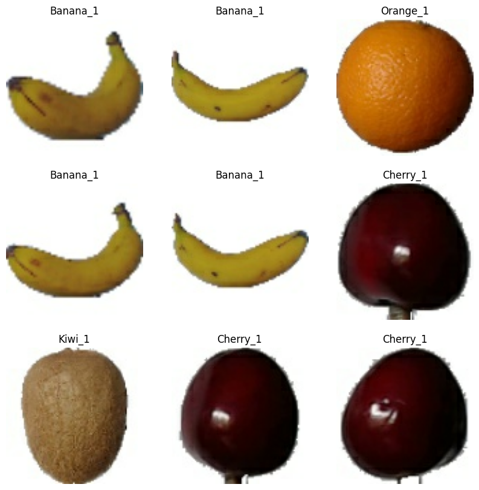
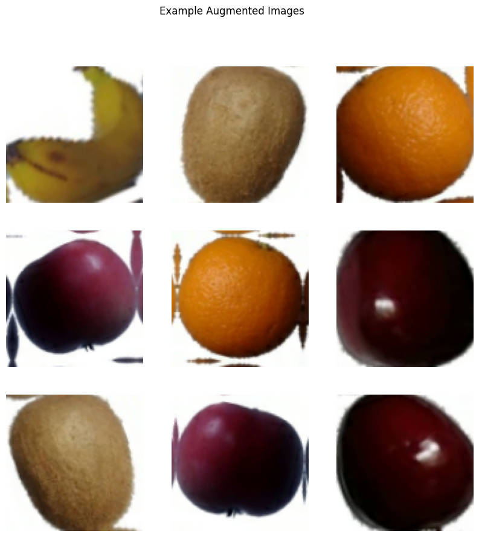
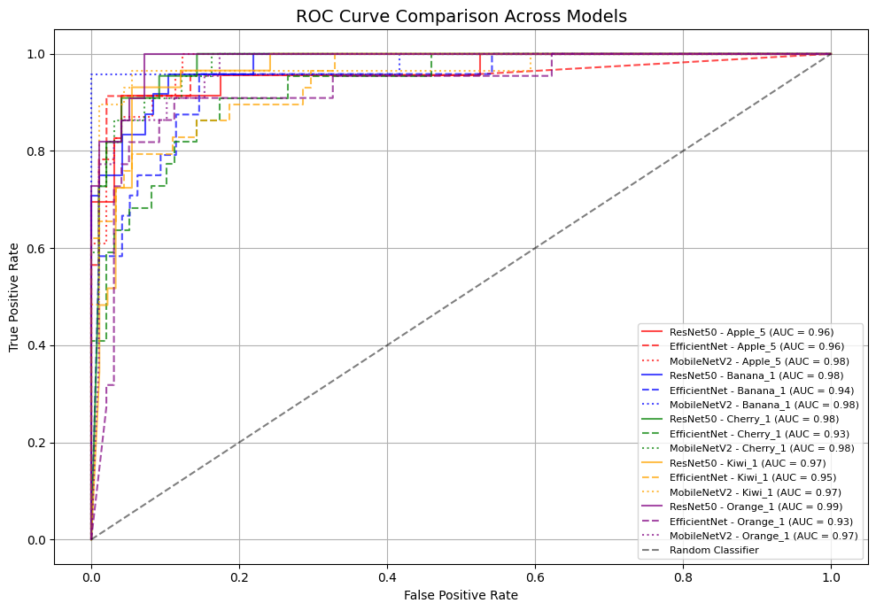
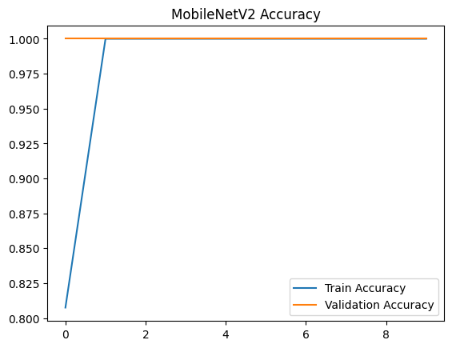
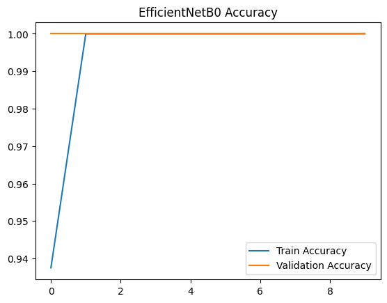
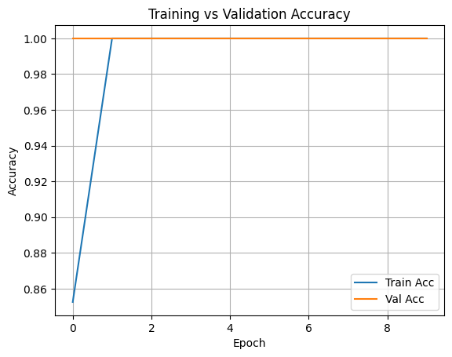

# Fruit Image Classification with Transfer Learning

## One Sentence Summary
This project classifies images of fruits using transfer learning with three pretrained CNN models: ResNet50, EfficientNetB0, and MobileNetV2.

---

## Overview
The goal of this project is to build an image classification model that identifies fruit types from images using transfer learning. A custom fruit image dataset with five classes was used, with fewer than 100 images per class. The task was framed as a multi-class classification problem. We trained three different transfer learning models—ResNet50, EfficientNetB0, and MobileNetV2—and compared their performance using validation accuracy and ROC curves. Data augmentation was applied to evaluate its impact on model generalization.

---

## Summary of Work Done

### Data

- **Type**: Image dataset
- **Classes**: Apple_5, Banana_1, Cherry_1, Kiwi_1, Orange_1
- **Input size**: 100x100 or 224x224 RGB images
- **Subset**: ~100 images per class

**Dataset Source**  
This project uses a subset of the [Fruits 360 dataset](https://www.kaggle.com/datasets/moltean/fruits) from Kaggle, originally published by Horea Mureșan. The full dataset contains over 138,000 images across 206 categories (fruits, vegetables, nuts, seeds). Images were collected under controlled lighting conditions and placed on plain white or dark backgrounds to ensure consistent quality. We selected a small subset of 5 classes for quick prototyping.

---

### Preprocessing

- Limited dataset to 5 classes
- Resized images to 100x100 (MobileNetV2) and 224x224 (ResNet50, EfficientNet)
- Split dataset into training and validation using `image_dataset_from_directory`
- Used `tf.data` pipelines for performance optimization

---

### Data Visualization & Augmentation

- Augmentations applied: RandomFlip, RandomRotation, RandomZoom
- Augmented samples were visualized to verify transformations
- 


---

### Problem Formulation

- **Input**: RGB image (100x100x3 or 224x224x3)
- **Output**: Class label (one of 5 fruit classes)
- **Task**: Multi-class image classification

---

## Models Trained

### Transfer Learning Models

- **ResNet50**
- **EfficientNetB0**
- **MobileNetV2**

All models used pre-trained ImageNet weights and a custom classification head.

---

## Training

- **Software**: Python 3, Google Colab
- **Libraries**: TensorFlow, Keras, matplotlib, scikit-learn
- **Epochs**: 10
- **Optimizer**: Adam
- **Loss**: SparseCategoricalCrossentropy
- **Environment**: Google Colab GPU

---

## Performance Comparison

All three models achieved **100% validation accuracy** after a few epochs. However, since the dataset was very small, the results may be influence by the structure and the clarity of the dataset. Below is the ROC curve comparison:


### Model Accuracy Curves




---

## Conclusions

Training without data augmentation showed steady performance improvements, with validation accuracy reaching 96% by the final epoch. After applying standard augmentation techniques such as random flips, rotations, and zoom, all three models: ResNet50, EfficientNetB0, and MobileNetV2 achieved 100% validation accuracy. While this initially suggested excellent generalization, the results appeared unexpectedly high given the small dataset size and limited class diversity.

Closer inspection revealed that the dataset was highly structured: images were clean, objects centered, and fruit classes clearly distinguishable by color and shape. This likely made the classification task relatively easy, allowing models to learn simple visual cues rather than deep, generalizable features.

To explore this further, a more rigorous test is planned: progressively reducing the number of training images per class, starting from just one image to examine how model performance scales with dataset size. This will help evaluate whether the models are genuinely learning meaningful patterns or simply fitting to a visually simple dataset.

---

## Future Work

- Gradually reduce the number of training images per class (starting with 1 image/class) to observe at what dataset size performance drops significantly  
- Test whether models still perform well without strong visual differences (e.g., using fruits with similar color/shape)  
- Expand to more classes from the full Fruits-360 dataset to increase task difficulty  
- Introduce regularization techniques (dropout, L2) to reduce overfitting  
- Evaluate on a held-out test set or an external dataset to assess generalization  
- Use explainability tools like Grad-CAM to visualize what parts of the image the model relies on

---

## How to Reproduce Results

1. Clone this repository  
2. Open notebooks in the following order:
    - `DataLoader.ipynb`
    - `TrainBaseModel.ipynb`
    - `TrainBaseModelAugmentation.ipynb`
    - `Train-ResNet50.ipynb`
    - `Train-EfficientNet.ipynb`
    - `Train-MobileNet.ipynb`
    - `CompareAugmentation.ipynb`
    - `CompareModels.ipynb`
3. Run all cells
4. *(Optional)* Generate ROC and accuracy comparison plots

---

## Files in Repository

| File                          | Description                                |
|-------------------------------|--------------------------------------------|
| `DataLoader.ipynb`            | Loads and prepares the dataset             |
| `TrainBaseModel.ipynb`        | Baseline training with MobileNetV2         |
| `TrainBaseModelAugmentation.ipynb` | MobileNetV2 with data augmentation   |
| `TrainEfficientNet.ipynb`    | Transfer learning using EfficientNetB0     |
| `TrainMobileNet.ipynb`       | Transfer learning using MobileNetV2        |
| `CompareAugmentation.ipynb`   | ROC curve comparison (augmented vs. baseline) |
| `CompareModels.ipynb`         | ROC comparison of all three models         |
| `Pictures/`                   | Folder for plots and image outputs         |

---

## Software Setup

```bash
pip install tensorflow matplotlib scikit-learn
